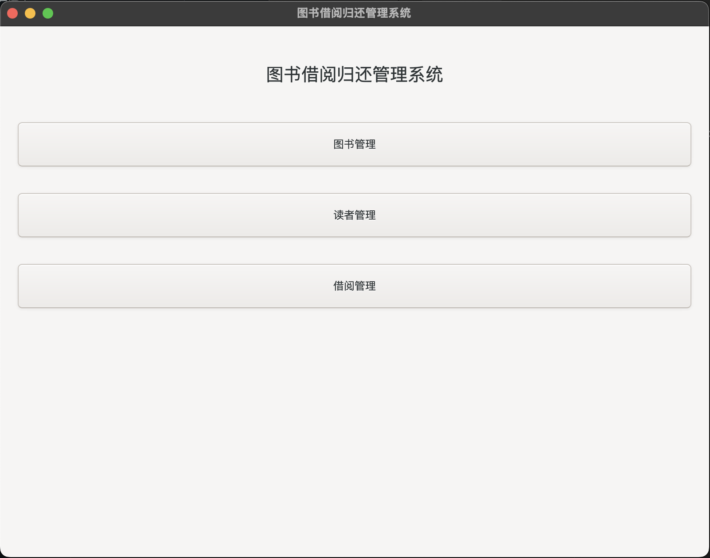
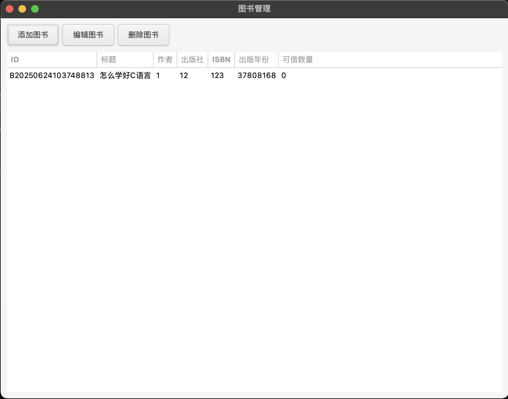
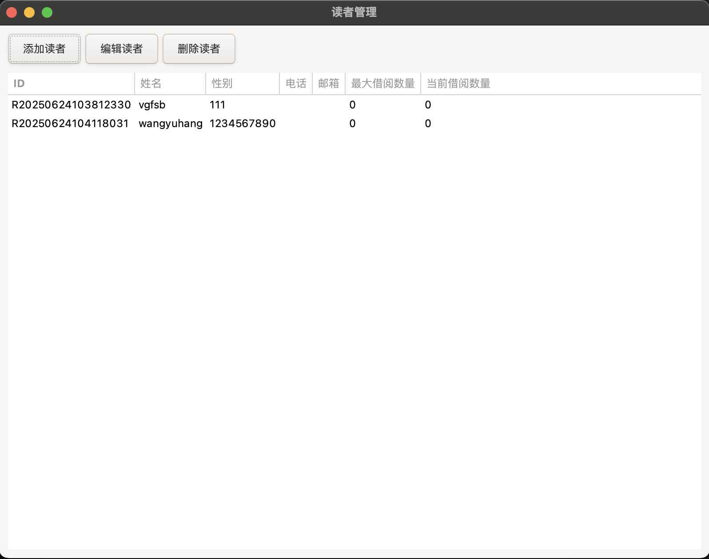
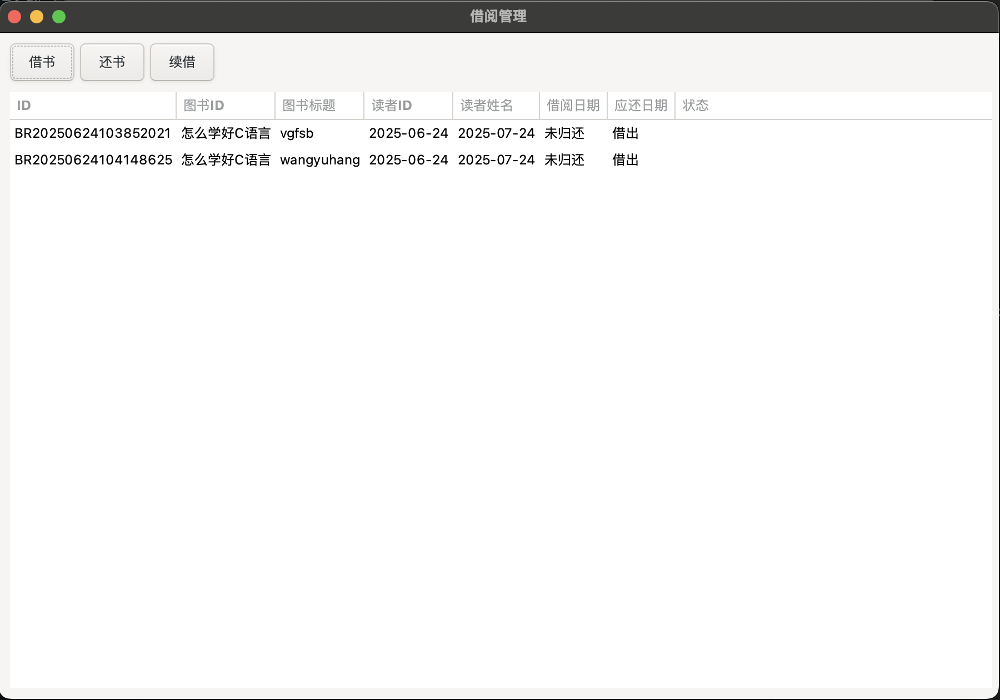

# 图书借阅归还管理系统

这是一个基于C语言和GTK+开发的简单图书借阅归还管理系统，具有图形用户界面，支持跨平台运行。

## 功能特点

- 图书信息管理：添加、删除、修改、查询图书信息
- 读者信息管理：添加、删除、修改、查询读者信息
- 借阅管理：图书借出、归还、续借、查询借阅记录
- 数据本地存储：所有数据直接存储在本地文件中，无需数据库
- 跨平台支持：可在Windows、Linux和macOS等多个平台上运行

## 技术栈

- 编程语言：C语言
- 图形界面库：GTK+ 3
- 数据存储：本地文件（CSV格式）

## 系统要求

- 支持GTK+ 3的操作系统（Windows、Linux、macOS等）
- C编译器（如GCC、Clang等）

## 编译与运行

### 安装依赖

#### macOS
```bash
brew install gtk+3
```

#### Ubuntu/Debian
```bash
sudo apt-get install libgtk-3-dev
```

#### Windows
在Windows上，建议使用MSYS2来安装GTK+3：
```bash
pacman -S mingw-w64-x86_64-gtk3
```

### 编译
```bash
make
```

### 运行
```bash
./book_manage_system
```

## 项目结构

- `main.c`: 程序入口
- `book.c/h`: 图书相关功能
- `reader.c/h`: 读者相关功能
- `borrow.c/h`: 借阅相关功能
- `ui.c/h`: 用户界面相关功能
- `utils.c/h`: 工具函数
- `data/`: 数据存储目录
  - `books.csv`: 图书数据
  - `readers.csv`: 读者数据
  - `borrows.csv`: 借阅记录数据

## 许可证

MIT

## 运行效果




